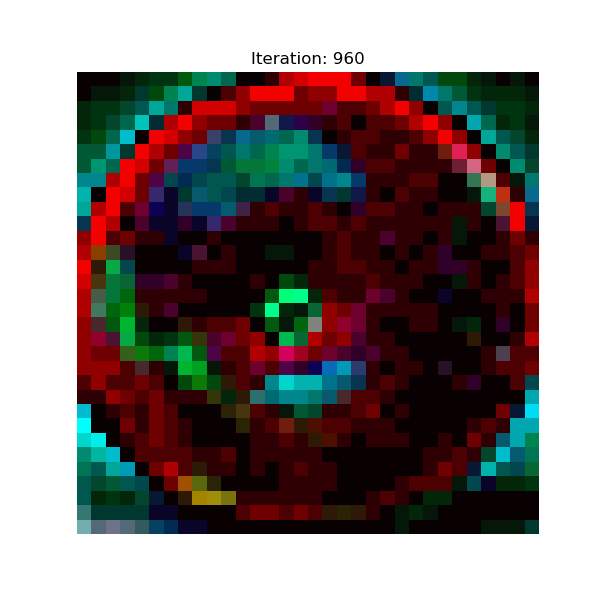
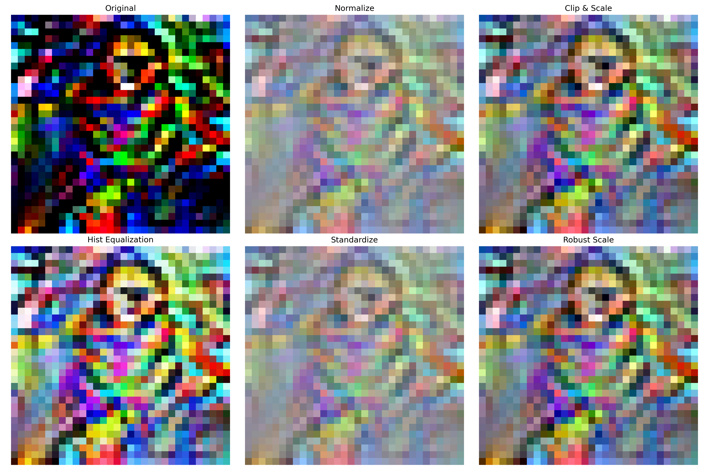
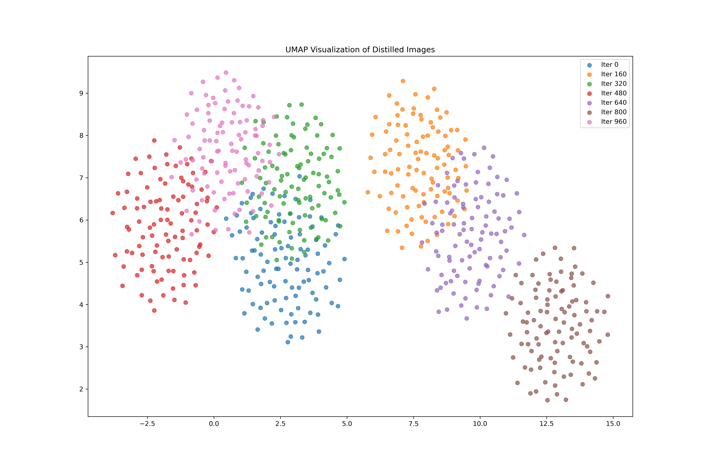
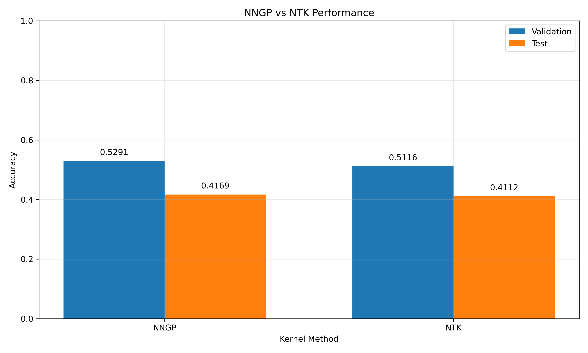

# Efficient Dataset Distillation using Random Feature Approximation

Code for the NeurIPS paper ["Efficient Dataset Distillation using Random Feature Approximation"](https://arxiv.org/abs/2210.12067)

Contact: [Karan Kumawat](k.kumawat@iitg.ac.in)

# Abstract of the Paper:
Dataset distillation compresses large datasets into smaller synthetic coresets which retain performance with the aim of reducing the storage and computational burden of processing the entire dataset. 
Today's best-performing algorithm, *Kernel Inducing Points* (KIP), which makes use of the correspondence between infinite-width neural networks and kernel-ridge regression, is prohibitively slow due to the exact computation of the neural tangent kernel matrix, scaling O(|S|2), with |S| being the coreset size. To improve this, we propose a novel algorithm that uses a random feature approximation (RFA) of the Neural Network Gaussian Process (NNGP) kernel, which reduces the kernel matrix computation to O(|S|). Our algorithm provides at least a 100-fold speedup over KIP and can run on a single GPU. Our new method, termed an RFA Distillation (RFAD), performs competitively with KIP and other dataset condensation algorithms in accuracy over a range of large-scale datasets, both in kernel regression and finite-width network training. We demonstrate the effectiveness of our approach on tasks involving model interpretability and privacy preservation.

# Example usage (PS: I have ran this on CIFAR100, but you can test it on mnist, fashion, cifar10, svhn & celeba datasets.)
To run generate a distilled set on CIFAR100, 1 sample per class, platt loss with label learning, for example:


```!python run_distillation.py --dataset cifar100 --save_path path/to/directory/ --samples_per_class 1 --platt --learn_labels ```

In case you don't want to learn labels, remove the argument ```--learn_labels```

## If you want to skip training and directly evaluate the dataset then you can go directly to evaluating the distilled set commands (I have uploaded the best distilled sets).

This will run for 1000 iteration and the last one i.e. 960.npz will be your best distilled set.

This does not automatically evaluate the dataset on the test set.

First rename this file as best.npz:
```!mv /RFAD/data/960.npz /RFAD/data/best.npz```

Create a eval_data directory:
```!mkdir /RFAD/eval_data```

Move the best.npz to eval_data directory:
```!mv /RFAD/data/best.npz /RFAD/eval_data```

To evaluate a distilled set with NNGP/NTK kernel ridge regression with an already made distilled dataset on all datasets except celebA:
```!python eval_distilled_set.py --dataset cifar100 --save_path path/to/directory --run_krr```

To evaluate a distilled set with a finite network trained with SGD on mnist, with an already made distilled dataset:

```!python eval_distilled_set.py --dataset cifar100 --save_path path/to/directory --run_finite --lr 1e-3 --weight_decay 1e-3 --label_scale 8` --centering ```

To automatically load the set of training hyperparameters used for finite training results in the paper, use the command "--use_best_hypers", i.e.

```!python eval_distilled_set.py --dataset cifar100 --save_path path/to/directory --run_finite --use_best_hypers ```

utils.py contains the best hyperparameters for finite network training

To run corruption experiments on CelebA with corruption 0.8:
```!python run_distillation.py --dataset celeba --save_path path/to/directory/ --samples_per_class 1 --platt --n_batches 1 --init_strategy noise --corruption 0.8```

To run CelebA experiments, make sure you are on the latest version of PyTorch, as older version have a bug where the test/train splis are incorrect.

To evaluate with NNGP KRR on CelebA:
```!python eval_distilled_set_batched.py --dataset celeba --save_path path/to/directory --run_krr```

I have additionally include some distilled dataset for cifar10 with 1,10, or 50 samples per class in ./distilled_images_final/cifar10 in the files 'best.npz'


# Requirements
- pytorch
- neural-tangents
- torch_optimizer
- sklearn, matplotlib, numpy, scipy
Note that some versions of pytorch have incorrect test/train splits for CelebA


## Distillation Results


*Evolution of distilled images during training*

### Comparison of Preprocessing Methods

*Impact of different preprocessing techniques on distilled images*

### Feature Space Visualization


### Comparison of Kernels

